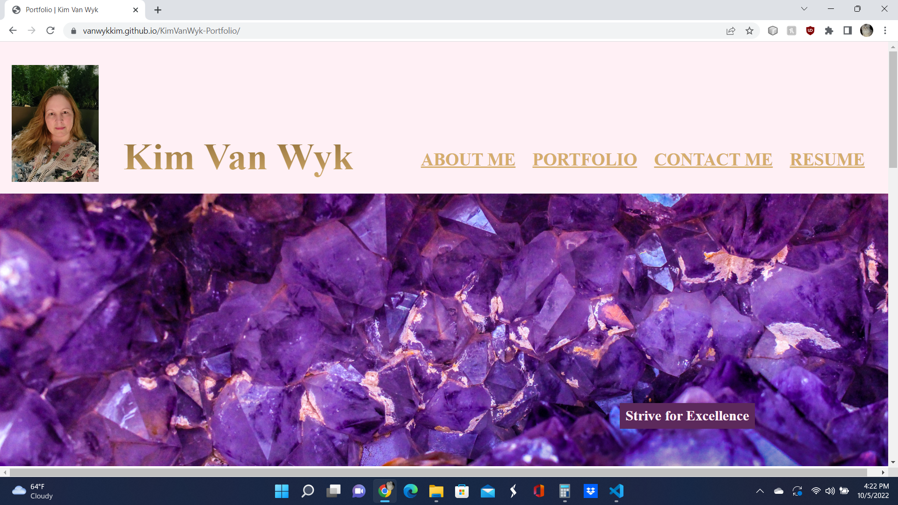

# KimVanWyk-Portfolio
---

## Description

A landing page for my portfolio work for prospective employers:

- Created a header with photo and menu bar with links to sections and resume
- Used flexbox to arrange the sections of the page, especially portfolio section
- Added an About Me section that describes my background
- Created HTML and CSS code to display the page
- Created a footer section with contact information and link to Linkedin
- Created a read.me

## Screenshot

## Link to Project

[https://vanwykkim.github.io/KimVanWyk-Portfolio/]

## Credits

Images on the form are from: https://www.pexels.com/search/texture/

Code for Gold Ombre effect from: https://addisonlegere.com/blog/gold-text-with-css-image/

## License

Please refer to the LICENSE in the repo.
